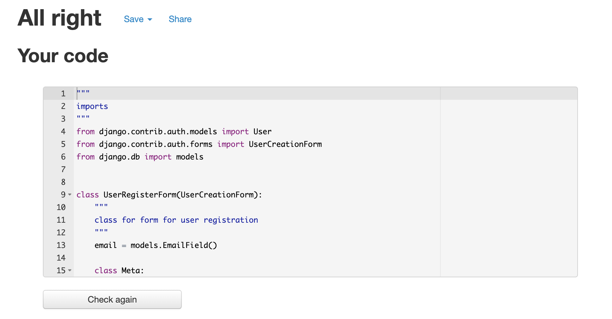

ToDo:
Features to readme
cleanup files
extra detail on heroku deployment


create better database diagram

add credits+


# Guess The Boozer
**Developer: Ronan McGill**


[Visit live website](https://reel-2022-new.herokuapp.com)

[view project board](https://github.com/users/RoMcGill/projects/1) > **_NOTE:_** This project board is linked to my repository but for some reason does not show up in the projects tab in the repository


## Table of Contents
  - [About](#about)
  - [User Goals](#user-goals)
  - [Site Owner Goals](#site-owner-goals)
  - [User Experience](#user-experience)
  - [User Stories](#user-stories)
  - [Design](#design)
    - [Colours](#colours)
    - [Fonts](#fonts)
    - [Structure](#structure)
      - [Website pages](#website-pages)
      - [Database](#database)
    - [Wireframes](#wireframes)
  - [Technologies Used](#technologies-used)
  - [Features](#features)
  - [Validation](#validation)
  - [Testing](#testing)
    - [Manual testing of user stories](#manual-testing-of-user-stories)
    - [Automated testing](#automated-testing)
    - [Performing tests on various devices](#performing-tests-on-various-devices)
    - [Browser compatibility](#browser-compatibility)
  - [Bugs](#bugs)
  - [Configuration](#configuration)
    - [Google emails](#google-emails)
    - [Heroku Deployment](#heroku-deployment)
  - [Credits](#credits)
  - [Acknowledgements](#acknowledgements)
---
## About

Guess the boozer is a social media game to play with friends, the object of the game is to guess what pub,bar,resteraunt your friends are in based on their vague images and hints, this is a game that my friends and I personaly Play most weekends and by creating guess the boozer we will bring the game to a wider audience.

----------

## User Goals

Register and Login to a new Social media site.

Join in on the fun and Create posts and give hints to other users so they can try tio guess where i am or have been.

guess where other users are or have been using the information they supply.

----
## Site Owner Goals

Create a platform for people to connect with eachother

Implement a gaming/puzzel aspect to the social media site

Spread awareness about new, fun, diffrent bars/pubs and resteraunts

----

## User Experience

### Target Audience

People who enjoy socialising.

People who enjoy puzzels.

People who enjoy gaming.

### User Requirements

Easy navigation, familiar layout and UX/UI design.

Easy to use.

Responsive layout for users on all devices.

User feedback from user actions.

Constant stream of new content from other users.

Ability to connect with other users.

Ability to share posts, connect and converse with other users.

Dedicated Page/blog to advertise and support businesses and inform users of updates to the site and any other relavant news.

----
## User Stories

### site Owner


User search
#25

Create contact us form
#24

Create a blog
#23

Users can create hashtags and view posts with same hashtags on one page
#22

Users can Comment on posts
#21

Users can create posts
#20

Build login/signup page
#1

Setup repository prep
#3

Deploy to heroku prep
#2

Install django + supporting libraries
#4

### Users

USER STORY  Create Post
#27

USER STORY  Be able to Like posts
#26

USER STORY  contact site owner
#19

USER STORY should be able to log into my account
#5


USER STORY have a log in page MUST HAVE
#6


USER STORY have an explore page
#7


USER STORY have a personal profile
#8


USER STORY a buy and sell section of the fourm.
#10


USER STORY be able tom follow other users
#9


USER STORY add gps location of solved boozers
#11


USER STORY add photos to posts
#12


USER STORY comment on other users posts
#13


USER STORY view other users posts
#14


USER STORY upload details of recent trips to the pub/resteraunt
#15


USER STORY discover more unique bars and restaurants near me
#16


USER STORY find good pubs, bars, restaurants local to me
#17


----


## Design

## Colours

the colour scheme was chosen as there is a nice contrast between diffrent elements which makes for a pleasurable user experience also the colour schem plays a role in helping the user feel familiar with the site as the gradient used is similar to instagram just with diffrent colours, the fade from dark green to bright green in the background is like instagrams gradient from dark purple to bright pink.


## Fonts
The fonts implemented on the site are Fira sans with sans-serif as a fallback these fonts were used thoughout the site to add charachter, style and legibility


## Structure
ease of use was the goal for this site. the navagation bar at ther top of the page provides easy clikable links to each section of the site, from there you can dive deeper into other features of the site.

### Website pages
### The website is made up of the following pages:

### Home page/feed
this page is your landing page once logged in and will propt you to update your profile information and instruct you what to do next, following these instructions you will find other users and populate this page with their posts after following some users.

### Register page
this is where a user can create an account.

### Login page
on this page users can login to their account.

### search page
this page will show users a list of other users and provide a button to search for users by name.

### Logout page
this page will allow users to log out of the website, this page will also provide the user with an option to log back in.

### Profile page
where users can add their profile picture first/last name, bio and website. This page will display thier profile image,bio, name, posted posts and favourited posts. If a user is on another users Profile page they will not have the option to edit their profile from there but will have an option to follow the user in its place.

### post detail page
is used for specific posts that a user clicks on, this page will show all of the details of a given post and also provide a button to view the comments and post/delete a comment, view the hashtags and likes associated with the post.

### the tags page
is where all posts with corrisponding tags are displayed.

### the favourites page
is located in the profile page and when clicked the user posts will no loger show but the posts that the given user has favourited will display instead.

### the comment page/modal
is used to display, post and delete comments on nay given post.

### the blog page
is a site owner run blog to promote businesses and provide users with information.

### Contact page
 with contact form which allows users to send an email to the site owner and provide their feedback or questions.

### 404 error page
----

## Database
The backend is built on the Django framework using Postgres for the deployed Heroku version I have created a graph model of the site using django-extensions and graphviz to display the model relationships.


### blogpost app

the blog post model contains title, slug, intro, body, date_added, picture,
the title field contains the title of the blog post
the slug field contains the individal slug for each blog post
the intro contains a breif subject line for the blog post
the body contains the main content for the blog post
the date added contains the date and time the blog was created
the picture field contains the image that is uploaded to support the text of the blog post.

### comment app
the comment model contains post, user, body, date
The post field contains a ForeignKey to id the post.
The user field contains a ForeignKey to id the user.
The body field contains a textfield to manage user input
The date field contains contains the date and time which the comment was posted.

### contact app
the contact model contains name, email, subject, message
The name field contains the users name
The email field contains the users email address
The subject field contains the subject/ reason for contact
The message field contains the main body/contact of the correspondance.

### post app

the post app contains 5 models follow, stream, likes, post and tag

the follow model contains follower and following
both fields contain foreignkey fields to identify users.

the stream model contains following, user, post, date.
the following field contains the following status of the user.
the user field contains the id of the user.
the post field contains the data being posted by the user.
the date field contains the date and time the stream was created.

the likes model contains user and post
the user field is to identify the user id
the post field is to identify the post id

the post model contains id, picture, caption, posted, tag, user, likes
The id field contains a unique id for the post.
The picture field contains a ImageField for users to upload photos.
The caption field contains a CharField for users to uplad a caption to their post.
The posted field contains DateTimeField to capture the date and time the post was posted.
The tag field contains a ManyToManyField for the hashtags.
The user field contains a ForeignKey to identify the user.
The likes field contains a IntergerField to handle the number of likes on a post.

the tag model contains title and slug
the title field is a CgarField for users to enter thier hashtags
the slug field is a SlugField for creating unique slugs for each hashtag

### userauthentication app
the userauthentication app contains the profile model
the profile model contains 9 Fields user, first_name, last_name, location, url, profile_info, created, favourite, image
the first_name, last_name, location, url fields are all CharFields for users to input their own information.
the user field is a OnetoOneField that contains the users username.
the profile_info Field is a textfield for the user to input information about themselves.
the created field is a DateTimeField to capture when the profile has been created,
the Favourite Field is a ManyToManyField that users can have their favourite posts by them selfs or by other users saved.
the image field is a ImageField for users to upload their Profile image

----

## Wireframes
<details>
<summary>Edit profile</summary>

</details>

<details>
<summary>Register</summary>

</details>

<details>
<summary>Login</summary>

</details>

<details>
<summary>Logout</summary>

</details>

<details>
<summary>Index</summary>

</details>

<details>
<summary>Blog</summary>

</details>

<details>
<summary>Contact us</summary>

</details>

<details>
<summary>Search</summary>

</details>

<details>
<summary>Feed</summary>

</details>

<details>
<summary>Profile</summary>

</details>


----

## Technologies Used

### Languages & Frameworks

- HTML
- CSS
- Javascript
- Python 3.10.2
- Django 3.2

### Libraries & Tools
Am I Responsive -

Cloudinary -

Favicon.io -

Chrome dev tools -

Gitpod -

GitHub -

CrispyForms

Google Fonts -

django_extentions -

Heroku -

jQuery -

Bootstrap -

Postgres –

graphviz -

gunicorn -

Pillow -

psycopg2 -

Balsamiq -

WC3 Validator -

Jigsaw W3 Validator -

JShint -

PEP8 -

Google dev tools -

Lighthouse -

responsinator -

----

## Features

### Nav bar
- Part of base.html
- Visible on all pages
- Fully responsive
- Features included on the nav bar will be diffrent for logged in users and logged out users as logged out users do not have access to as many Features as logged in users.
- Easy to navigate
<details>
<summary>screenshot</summary>


</details>

### Register
- page for  new users to create their account
- Easy to follow
- User must provide a valid username, password and password confirmation and email address

<details>
<summary>screenshot</summary>


</details>

### Login
- Page for users to log in to their account
- Easy to follow
- User must fill out 2 form fields Username and Password
- Logged in user will be redirected to  the feed and have access to all features
- User story [#1](https://github.com/RoMcGill/Reel/issues/1), User story [#6](https://github.com/RoMcGill/Reel/issues/6)

<details>
<summary>screenshot</summary>


</details>

### Create/edit profile
- Easy to follow form
- gives users the option to add a personal profile picture, first name, last name, bio, location and website
- Once form is submitted users will be redirected to their updated profile page
- [#8](https://github.com/RoMcGill/Reel/issues/8)

<details>
<summary>screenshot</summary>


</details>


### Add Post
- Easy to follow form
- users can add a picture, caption and hashtag/'s
- this will be displayed on a card as a post
- Once form is complete users will be redirected to their profile page where the post will show, thier new post will also show up in the Feed
- [#27](https://github.com/RoMcGill/Reel/issues/27), [#22](https://github.com/RoMcGill/Reel/issues/22),

<details>
<summary>screenshot</summary>


</details>

### Search for users
- The search page will Provide a List of all of the users
- The search page has a search button where users can type in the names of their friends and have their profile show
- [#25](https://github.com/RoMcGill/Reel/issues/25), [#18](https://github.com/RoMcGill/Reel/issues/18)

<details>
<summary>screenshot</summary>


</details>

### View Users Profiles
- Users can access other users Profiles in 2 ways
- The search Feature or through the Feed: each post will have a clickable link to the users Profile

<details>
<summary>screenshot</summary>


</details>

### Follow Users
- Once in another users profile users will have the option to follow or unfollow a user
- if a user is not following the user the follow button will apear
- if a user is following the user the unfollow button will apear
- [#9](https://github.com/RoMcGill/Reel/issues/9)


<details>
<summary>screenshot</summary>


</details>


### Like users posts
### Comment on users posts
### Delete comments you have made
### Add users posts to favourites
### View feed
### View Hashtag page's
### Blog
### Contact
### Log out
---
## Validation
### Chrome Dev Tools Lighthouse
Lighthouse was used to test the performance, accessibility, best practice and SEO of the site.

<details>
<summary>Edit profile</summary>

</details>

<details>
<summary>Register</summary>

</details>

<details>
<summary>Login</summary>

</details>

<details>
<summary>Logout</summary>

</details>

<details>
<summary>Index</summary>

</details>

<details>
<summary>Blog</summary>

</details>

<details>
<summary>Contact us</summary>

</details>

<details>
<summary>Search</summary>

</details>

<details>
<summary>Feed</summary>

</details>

<details>
<summary>Profile</summary>

</details>

----

### HTML

I used The W3C Markup Validation Service to validate the HTML of the website, some changes had to be made to account for the validation service not recognising django static tags.

<details>
<summary>Contact us</summary>

</details>

<details>
<summary>Edit Profile</summary>

</details>


<details>
<summary>Feed</summary>

</details>


<details>
<summary>Login</summary>

</details>


<details>
<summary>Logout</summary>

</details>


<details>
<summary>Profile</summary>

</details>


<details>
<summary>New Post</summary>

</details>


<details>
<summary>Post Details/Comments</summary>

</details>


<details>
<summary>Register</summary>

</details>


<details>
<summary>Search</summary>

</details>


<details>
<summary>Tags</summary>

</details>

----

CSS Validation
I used the  W3C Jigsaw CSS Validation Service to validate the CSS of my website. When validating all of my css on the site, it passes with no errors.

<details>
<summary>CSS</summary>

</details>

----

### JavaScript Validation

I used JSHint JS Validation Service to validate my Javascript files. No errors were found.

<details>
<summary>Java Script</summary>

</details>


----

### PEP8 Validation
I used PEP8 Validation Service to check the code for PEP8 requirements. All the code passes with no errors and no warnings to show Bar one url file that one line was 2 charachters too log, I decided to leave it as when it was formated to meet requirements it was less legible

### Blog

<details>
<summary>Models</summary>

</details>

<details>
<summary>Admin</summary>

</details>

<details>
<summary>Url</summary>

</details>

<details>
<summary>Views</summary>

</details>

### Comment

<details>
<summary>Models</summary>

</details>

<details>
<summary>Admin</summary>

</details>

<details>
<summary>Url</summary>

</details>

### Search

<details>
<summary>Views</summary>

</details>

<details>
<summary>Url</summary>

</details>


### Contact us

<details>
<summary>Models</summary>

</details>

<details>
<summary>Views</summary>

</details>

<details>
<summary>Url</summary>

</details>

<details>
<summary>Admin</summary>

</details>

### Post


<details>
<summary>Url</summary>

</details>

<details>
<summary>Admin</summary>

</details>

<details>
<summary>Form</summary>

</details>

<details>
<summary>Models</summary>

</details>

<details>
<summary>Views</summary>

</details>

### Userauthentication

<details>
<summary>Models</summary>

</details>

<details>
<summary>Admin</summary>

</details>

<details>
<summary>Form</summary>

</details>

<details>
<summary>Url</summary>

</details>

<details>
<summary>Views</summary>

</details>

### Members

<details>
<summary>Views</summary>

</details>

<details>
<summary>Url</summary>

</details>

<details>
<summary>Models</summary>

</details>

<details>
<summary>Form</summary>

</details>

---
## Testing
### Manual testing

I performed manual testing throughout the whole prcess of building this site, I also took into account my user storys while creating my manual testing plan.


**Step** | **Expected Result** | **Actual Result**
------------ | ------------ | ------------ |
|from landing page Register a new account <sup>User Story #1,5</sup> |new account would be created| new account created and welcome message apears letting me know I have created an account|
<details>
<summary>Screenshot</summary>

</details>


**Step** | **Expected Result** | **Actual Result**
------------ | ------------ | ------------ |
| Login as New user <sup>User Story #6</sup>| have acccess to the rest of the features on the site|all sites features are available once user is logged in.|
<details>
<summary>Screenshot</summary>

</details>


**Step** | **Expected Result** | **Actual Result**
------------ | ------------ | ------------ |
| Setup profile <sup>User Story #8</sup>|have the ability to personalise my profile|users can add their own personal profile picture, firstname, last name, bio, location and website|
<details>
<summary>Screenshot</summary>

</details>


**Step** | **Expected Result** | **Actual Result**
------------ | ------------ | ------------ |
|create a post <sup>User Story #20, #27</sup>|to be able to create a post that other users can see and interact with|post created with picture, hashtag, and caption with the ability for other users to like comment and favourite it.|
<details>
<summary>Screenshot</summary>

</details>


**Step** | **Expected Result** | **Actual Result**
------------ | ------------ | ------------ |
|browse the feed <sup>User Story #14, #17, #7</sup>|see other users posts|the ability to see other users posts and interact with them|
<details>
<summary>Screenshot</summary>

</details>


**Step** | **Expected Result** | **Actual Result**
------------ | ------------ | ------------ |
|search for other users <sup>User Story #25</sup>|see a list of other users|a list of users + a searchbar to search for specific users|
<details>
<summary>Screenshot</summary>

</details>


**Step** | **Expected Result** | **Actual Result**
------------ | ------------ | ------------ |
|follow other users <sup>User Story #9</sup>|be able to follow other users|ability to follow users and have it reflect in the number of users on both profiles|


**Step** | **Expected Result** | **Actual Result**
------------ | ------------ | ------------ |
|browse other users posts on other users profile <sup>User Story #13, #8</sup>|list of posts on users profile page|list of posts displayed on users profile|
<details>
<summary>Screenshot</summary>

</details>


**Step** | **Expected Result** | **Actual Result**
------------ | ------------ | ------------ |
|add other users posts to my favourites|add posts to a favourite folder|favorited posts go into a page on my profile for anyone to see if they click the favourites button beside the the posts button|
<details>
<summary>Screenshot</summary>

</details>


**Step** | **Expected Result** | **Actual Result**
------------ | ------------ | ------------ |
|like other users posts <sup>User Story #26</sup>|users will see that I have liked other users post|the number of likes on a post raises by 1 every time a user likes it|


**Step** | **Expected Result** | **Actual Result**
------------ | ------------ | ------------ |
|unlike a post|the like will go away| the number of likes on the post droped by 1|


**Step** | **Expected Result** | **Actual Result**
------------ | ------------ | ------------ |
|comment on other users posts <sup>User Story #13</sup>|comment will show up under post|comment is displayed in the post details which can be accessed through the feed or users profile or anywhere the post is on the site|
<details>
<summary>Screenshot</summary>

</details>


**Step** | **Expected Result** | **Actual Result**
------------ | ------------ | ------------ |
|delete my comments <sup>User Story #13</sup>|.button to remove comments posted by me|button below my comments deletes them and shows a message confirming i delketed the comment|
<details>
<summary>Screenshot</summary>

</details>


**Step** | **Expected Result** | **Actual Result**
------------ | ------------ | ------------ |
|search the hastags from other users posts <sup>User Story #22</sup>|look at what hashtags people are posting on other users posts and click them to see other users popularity|all posts with the same hashtags are displayed to get to that page just click the hashtag you want to see|
<details>
<summary>Screenshot</summary>

</details>


**Step** | **Expected Result** | **Actual Result**
------------ | ------------ | ------------ |
|look at other users favorited posts|click other users favourites button and see a list of other users favourite posts|favourites are displayed in place of the users posts when the favourite button is clicked|
<details>
<summary>Screenshot</summary>

</details>


**Step** | **Expected Result** | **Actual Result**
------------ | ------------ | ------------ |
|contact the site owner <sup>User Story #24, #19</sup>|enter in my information an messsage and send message|message sent and message apears to confirm I have sent a message to site owner|
<details>
<summary>Screenshot</summary>

</details>


**Step** | **Expected Result** | **Actual Result**
------------ | ------------ | ------------ |
|read the site owners blog <sup>User Story #23, #16</sup>|see a list of blog posts|blog posts are displayed on the blog page|
<details>
<summary>Screenshot</summary>

</details>


**Step** | **Expected Result** | **Actual Result**
------------ | ------------ | ------------ |
|logout of my account|not be able to access some of the sites features|log out stops users from being able to see some site features|
<details>
<summary>Screenshot</summary>

</details>


**Step** | **Expected Result** | **Actual Result**
------------ | ------------ | ------------ |
|log back in<sup>User Story #1, #6</sup>|be able to click a button to log back in |there is an option to log back in once logged out|
<details>
<summary>Screenshot</summary>

</details>


**Step** | **Expected Result** | **Actual Result**
------------ | ------------ | ------------ |
|edit/ update my profile <sup>User Story #8</sup>|edit my profile and update/change some information|all updated information changes instantly and a message apears to confirm I have updated my profile|
<details>
<summary>Screenshot</summary>

</details>


**Step** | **Expected Result** | **Actual Result**
------------ | ------------ | ------------ |
|login on a mobile device|be able to login to my account |all features available on the desktop site are available on mobile|
<details>
<summary>Screenshot</summary>

</details>


**Step** | **Expected Result** | **Actual Result**
------------ | ------------ | ------------ |
|re trace all steps taken again on mobile device|all steps work the same as on desktop site|all steps work the same as on desktop site|


## Automated testing
*** not done yet ***


## Performing tests on various devices

The website was tested using Google Chrome Developer Tools on all devices available asell as the sesponsive toggle where you can drag to your prefered screensize. I also tested all available screen sizes on responsinator.com and amiresponsive.com

The website was tested on the following devices:

MacBook Pro
Samsung Galaxy s21 ultra
Samsung Galaxy Tab2


## Browser compatibility
Testing has been carried out on the following browsers:

google chrome Version 103.0.5060.53 (Official Build) (x86_64)

Safari Version 14.1.2 (14611.3.10.1.7)

Samsung Internet Version (18.0.0.58)

----

## Bugs

| **Bug** | **Fix** |
| ------- | ------- |
|29th June: tried to create user models. without having django User authentication in my imports| import from django.contrib.auth.models import User|
|4th July: could not display my deployed site on heroku anymore|there was heroku maintance which chnaged my cofig vars on heroku, I updated my env.py file with the correct information.|
|4th July: the error was cannot type cast int to uuid, cused by migrating my user model with primary key, then changing to uuid|migrate model with no primary key then migrate with uuid|
|7th July: issue with database|reset database, still was not working, started new repo from scratch <details><summary>Tutor support chat log</summary>https://docs.google.com/document/d/16XlYW9u0hWma5bD7lxAs2pWkMaWi_GtUyotDagPRKVg/edit?usp=sharing</details>|
|12th July:heroku not showing anything| created runtime txt file and moved my procfile to be in the same app as manage.py|
|12th July: I cannot create a post with a hashtag that has already been created|I was using title unique =True so i removed that, and added it to my SlugField which is where it was supposed to be all along.|
|12th July:After Heroku deployment, no css shown on deployed site|installed whitenoise middleware to serve static files for production, later installed cloudinary.|
|26th July:comments working in post-details but not in profile or index|(unconventional fix) instead of displaying comments on index + profile I linked the post-details to Post and index.|
|27th July: template for login/logout not showing|create templates folder with login/logout html files directly in members app|
|2nd August:profile details not displaying|my model for profile details had an field called bio but i was showing profile-info in my view, made them both the same and it worked|
|22nd August:logout button was not logging user out| created a logout function in members.views|
|TBA: getting a success message when user logs in|have tried placing the success message after the function to login, before it redirects and after but still no message shown.|

----

## Heroku Deployment (expand on this)
### Heroku Deployment
This application has been deployed from GitHub to Heroku by following the steps:

1. Create or log in to your account at heroku.com
2. Create a new app, add a unique app name (this project is named "reel-2022-new") and choose your region
3. Click on create app
4. Under resources search for postgres, and add a Postgres database to the app
5. Install the plugins dj-database-url and psycopg2-binary
6. Install django and gunicorn
7. Add the list of requirements by writing in the terminal "pip3 freeze --local > requirements.txt"
8. Create a Procfile in your app:
   ```
   wsgi:PROJECT_NAME.wsgi
   ```
   (web: gunicorn reel.wsgi)
9.  In the settings.py ensure the connection is to the Heroku postgres database
10. Ensure Debug is set to False in the settings.py file
11. Add localhost/127.0.0.1, and reel-2022-new.herokuapp.com to the ALLOWED_HOSTS variable in settings.py
12. Go to Settings in your Heroku and set the environment variables in the Config Vars
    
13. Remove DISABLE_COLLECTSTATIC from Heroku settings
14. Push the code to Heroku using the command git push heroku main

Final steps:

- Go to "Deploy" in the menu bar on the top
- Deployment method: Heroku Git (direct connection to GitHub is no longer available)
- Follow steps as shown:
  


-----

### Forking the GitHub Repository
1. Go to the GitHub repository
2. Click on Fork button in top right corner
3. You will then have a copy of the repository in your own GitHub account.

### Making a Local Clone
1. Go to the GitHub repository
2. Locate the Code button above the list of files and click it
3. Highlight the "HTTPS" button to clone with HTTPS and copy the link
4. Open commandline interface on your computer
5. Change the current working directory to the one where you want the cloned directory
6. Type git clone and paste the URL from the clipboard
7. Press Enter to create your local clone

-----

## Credits

-----

## Acknowledgements


